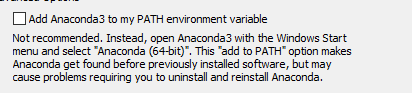

# 01 환경 구축 및 파이썬 기본 문법

파이썬 데이터 분석 환경 구축 커리큘럼에 관한 repo 입니다.
아나콘다를 통해 파이썬을 설치하고, 주피터 노트북으로 코드를 입력하고 결과를 확인하는 시간을 가질 예정입니다.

계획은 다음과 같습니다.
1. 아나콘다, 주피터 노트북 설치, print("hello world!")
2. 파이썬 기본 문법에 대해(변수 및 자료형에 대해 소개)
3. 조건문/반복문
4. 함수 구축
5. 실습예제 - 계산기 만들기?

## 1-1.아나콘다, 주피터 노트북 설치

### 아나콘다/파이썬/주피터 노트북 설치

아나콘다 설치 링크 : https://www.anaconda.com/distribution/#download-section

컴퓨터 환경(운영체제/레지스터(x64/x32)등)에 맞춰 다운로드

환경 변수 지정 체크할 것



지금 설치하는 아나콘다 및 파이썬을 기본 경로로 설정합니다. 만일 다른 인터프리터(다른 버전의 파이썬이라든가)를 사용하고 있으면 충돌이 일어날 수도 있다는 이야기 입니다.

아나콘다 키고 주피터 노트북 키기

### hello world! 출력

설치가 제대로 되었는 지 마지막으로 확인하자.

기본적으로 컴퓨터 유저의 root 폴더로 가 있다. 잘 찾아보시면 Desktop이라 적혀있는 폴더가 있을 것. 거기로 들어가도록 유도

Desktop, 즉 바탕화면에 New를 클릭하고 파이썬이나 폴더 등을 만들 수 있다. 밑의 터미널은 명령 프롬프트로 이동하게 되는데, 이번 스터디에서는 쓸 일이 없을 것이다.

Python 3를 누르면 확장자 untitled라는 이름의 창이 생성되고, 바탕화면에는 untitled.ipynb 파일이 생성된다. 여기서 데이터 읽기/데이터 처리/데이터 분석 모든것을 해볼 수 있다.

print('hello world!') 입력

~~~python
print("hello world!")
~~~

~~~python
>> 'hello world!'
~~~


### 주피터 노트북 환경 소개

#### 단축키

shift + enter : 코드를 구동합니다.

A : 선택한 셀 위쪽에 새로운 셀을 생성합니다.

B : 선택한 셀 아랫쪽에 새로운 셀을 생성합니다.

D : 선택한 셀을 삭제합니다(두 번 입력해야 합니다)

M : 선택한 셀을 마크다운 모드로 전환합니다.

Y : 선택한 셀을 코드 입력 모드로 전환합니다.

#### 위의 버튼들

run : 코드를 구동합니다.

네모 : 돌아가고 있는 코드를 멈춥니다.

새로고침 : 커널(서버라 생각하시면 됩니다)을 재시작합니다. 돌아가고 있는 코드도 강제 종료합니다.

가속 버튼 : 커널을 재시작하고 셀에 있는 모든 코드를 다시 구동합니다.

## 1-2.파이썬 기본 문법
### 자료형(Data Type)

#### int

integer 약자. 정수 형태.

~~~python
type(1)
~~~

~~~ python
>> int
~~~

#### float

실수 형태를 의미합니다.

소수로 표현됩니다.

~~~python
type(0.5)
~~~

~~~python
>> float
~~~

과학표기법으로도 표기할 수 있습니다.

~~~python
1.23e6 # 1.23 * 10^6
~~~

~~~python
>> 1230000.0
~~~

#### bool

boolean 약자. 논리연산을 위한 타입. True/False로 표현되는 값

~~~python
type(True)
~~~

~~~python
>> bool
~~~

#### list

여러 데이터의 모음

대괄호([])와 쉼표로 표현

위치(몇번째 값인지)를 통해 값을 가져올 수 있음. 위치는 0부터 시작.

'타입에 구애받지 않고 넣을 수 있다'

~~~python
type([1,2,3])
>> list
[1,2,3][1]
>> 2
[1, 0.5, "십", 4]
>> [1, 0.5, '십', 4]
~~~

리스트 내부 값을 변경하거나 삭제, 값을 추가할 수 있음.

~~~ python
a = [1,2,3]
print(a) #오리지널 list
a[1] = 5
print(a) #두번째(리스트 1번 위치) 값 변경 후 확인 
a.pop()
print(a) #맨 뒤의 값 제거 후 확인
a.append(10)
print(a) #맨 뒤에 새로운 값 추가 후 확인
~~~

~~~python
>> [1,2,3]
>> [1,5,3]
>> [1,5]
>> [1,5,10]
~~~

몇번째 값인지 가져오는 것을 '인덱싱'이라 합니다.

인덱싱은 단일 값 말고도 특정 범위의 값을 가져올 수도 있습니다.

이를 '슬라이싱'이라고 합니다.

~~~python
a = [1,2,3,4,5,6,7,8,9,10]
print(a[9]) #인덱싱. 단일 값 가져오기
print(a[8:10]) #슬라이싱, 특정 범위 값을 가져옵니다. m <= list < n 으로 범위 산정되는 거 기억하세요
print(a[:5]) #앞의 숫자가 없으면 맨 처음 부터 가져옵니다.
print(a[4:]) #뒤의 숫자가 없으면 특정 값 부터 맨 뒤까지 가져옵니다.
~~~

~~~python
>> 10
>> [9, 10]
>> [1, 2, 3, 4, 5]
>> [5, 6, 7, 8, 9, 10]
~~~

#### tuple

리스트와 비슷한 데이터 모음

괄호와 쉼표로 표현

위치를 통해 값을 가져올 수 있다.

'요소를 변경할 수 없다'(삭제, 변경, 추가 불가)

~~~python
type((1,2))
>> tuple
~~~

~~~python
(1,2)[1]
>> 2
~~~

~~~python
a = (1,2)
a[1] = 5
~~~

~~~python
>> TypeError: 'tuple' object does not support item assignment
~~~

#### set

리스트와 비슷한 데이터 모음, 집합

중괄호와 쉼표로 표현한다.

중복 값이 없고, 순서에 대한 개념이 없다.

연산자를 통해 집합처럼 구현할 수 있다.

'&' : 교집합

'|' : 합집합

'-'  : 차집합

~~~python
type({1,2})
~~~

~~~python
>> set
~~~

~~~python
{1,2,3,1,2}
~~~

~~~python
>> {1,2,3}
~~~

~~~python
a = {1,2,3}
print(a[1])
~~~

~~~python
>> TypeError: 'set' object is not subscriptable
~~~

~~~python
a = {1,2,3}
b = {2,3,4}
print(a & b) #교집합
print(a | b) #합집합
print(a - b) #차집합
~~~

~~~python
>> {2,3}
>> {1,2,3,4}
>> {1}
~~~

#### dictionary

key와 value 쌍으로 이루어져 있는 데이터 모음.

중괄호와 콜론, 쉼표로 이루어진다.

{<'key'> : <'value'>}

~~~python
type({'나이' : 29})
~~~

~~~python
>> dict
~~~

key에 대한 중복이 없음. 순서 개념도 없음.

~~~python
a = {'나이' : 29}
print(a[0])
~~~

~~~python
>> KeyError: 0
~~~

key를 통해 value를 조회할 수 있다.

~~~python
a = {
    '이름' : '이동재',
    '나이' : 29,
    '키' : 300,
    '몸무게' : 10,
}
print(a['이름'])
~~~

~~~python
>> 이동재
~~~

#### string(str)

문자나 문자열

~~~python
type("안녕하세요.")
~~~

~~~python
>> str
~~~

문자열도 리스트 때의 인덱싱이 가능합니다.

슬라이싱도 가능합니다.

~~~python
a = "안녕하세요."
print(a[2])
print(a[:2])
print(a[3:])
~~~

~~~python
>> 하
>> 안녕
>> 세요.
~~~

개행 문자 및 탭 문자

백슬래시(혹은 원화 표시)가 포함된 문자입니다.

문자열과 혼용 시, 출력 때는 보이지 않고 문자열을 개행(행넘김)하거나 탭(탭 문자나 들여쓰기) 기능이 적용 됩니다.

~~~python
print("안녕하세요.\n만나서 반갑습니다.")
~~~

~~~python
>>
안녕하세요.
만나서 반갑습니다.
~~~

~~~python
print("이름\t이동재")
print("나이\t29살")
~~~

~~~python
>>
이름	이동재
나이	29살
~~~

개행 문자도 출력하고 싶으면 앞에 r을 붙이면 됩니다(raw라는 의미입니다.)

~~~python
print(r"안\n녕\n하\n세\n요.")
~~~

~~~python
>> '안\n녕\n하\n세\n요.'
~~~

아주 긴 문자열도 다룰 수 있습니다.

' '"""<문자열>""" ' 이런식으로 표현 하면 됩니다.

큰 따옴표  안에 작성하는 문자열은 엔터를 해서 입력해도 하나의 문자열로 적용됩니다.(보면 개행 문자가 들어간 걸 알 수 있습니다.)

~~~python
"""
안녕하세요. 만나서 반갑습니다. 인사이저 입니다.
오늘은 파이썬 데이터 분석 스터디 첫번째 날입니다.
잘 부탁드립니다.
"""
~~~

~~~python
>> '\n안녕하세요. 만나서 반갑습니다. 인사이저 입니다.\n오늘은 파이썬 데이터 분석 스터디 첫번째 날입니다.\n잘 부탁드립니다.\n'
~~~

#### 데이터 형변환

데이터의 타입을 변환하여 입맛대로 다룰 수 있습니다. 다만 형 변환 시 아다리가 맞아 떨어져야 됩니다.

형 변환은 <'타입'>('값') 의 형태로 입력합니다.

~~~python
a = '1' # '1'은 숫자로 변환 가능합니다.
print(type(a))
a = int('1')
print(a)
print(type(a))
~~~

~~~python
>> <class 'str'>
>> 1
>> <class 'int'>
~~~

~~~python
a = '안녕'
print(int(a))
~~~

~~~python
>> ValueError: invalid literal for int() with base 10: '안녕'
~~~

list, set , tuple 등 데이터 모음과 관련된 타입들 끼리 변환 가능합니다.

list나 tuple에서 set으로 바꾸게 될 경우 중복 값들은 전부 제거됩니다.

~~~python
print(set([1,2,3,4,1,2,3,4]))
print(set(("안녕", "하세요", "만나서", "안녕", "하세요")))
~~~

~~~python
>> {1, 2, 3, 4}
>> {'안녕', '만나서', '하세요'}
~~~

bool type의 경우, 0 혹은 None(아무것도 없다는 뜻입니다.), [],(),{}일 경우 False, 나머지는 어떠한 값이 들어오면 True로 바뀝니다. 이는 후술할 조건식에서도 쓰입니다.

~~~python
print(bool(0))
print(bool(1))
print(bool(None))
print(bool([]))
print(bool([1]))
~~~

~~~python
>> False
>> True
>> False
>> False
>> True
~~~

#### 변수

상수와 반대되는 개념.

값을 저장하는 하나의 바구니 개념으로 생각하시면 됩니다.

바구니의 값은 언제든지 바꿀 수 있습니다.

~~~python
a = 1
print(a)
a = 2
print(a)
~~~

~~~python
>> 1
>> 2
~~~

바구니는 여러개를 만들 수 있습니다.

~~~python
a = 1
b = 2
c = 3
d = 4
print(a,b,c,d)
~~~

~~~python
>> 1 2 3 4
~~~

바구니의 이름은 주로 영어(대소문자)+숫자+언더바(_) 조합으로 만들 수 있습니다.

~~~python
abc = 10
a1_b2_c3 = 'test'
helloworld2020 = 'hello world!'

print(abc)
print(a1_b2_c3)
print(helloworld2020)
~~~

~~~python
>> 10
>> test
>> hello world!
~~~

첫 자리에 숫자를 입력할 수 없습니다.

언더바 제외하고 특수문자도 못씁니다.

~~~python
abc@@ = 10
abc&bdc = 'abcabc'
123a = 123
~~~

~~~python
>> SyntaxError: invalid syntax
~~~

파이썬 키워드를 변수 명으로 사용할 수 없습니다.

밑이 파이썬 키워드 리스트. 다 외울 필요는 없다. 그냥 주피터에 변수명으로 하고자 하는 이름을 입력했을 때 **색이 바뀌면 그건 변수로 쓰면 안된다**라고 알고 있으면 됨.

```python
False, None, True, and, as, assert, break, class, continue, def, del, 
elif, else, except, finally, for, from, global, if, import, in, is, 
lambda, nonlocal, not, or, pass, raise, return, try, while, with, 
yield
```


### 산술/비교/논리 연산자

#### 산술 연산자 (+, -, *,**, /, %,//)

##### '+', '-', '*', '/'

단순한 사칙 연산. 출력해보면 압니다.

~~~python
print(10+5)
print(10-5)
print(10*5)
print(10/5)
~~~

~~~python
>>15
>>5
>>50
>>2.0
~~~

'*'(곱하기)나 '/'(나누기)시 타입의 변화가 일어날 수 있습니다. (int -> float)

~~~python
a = 10
b = 2.0
print(type(a)) #10의 데이터 타입 -> int
print(a*b) 
print(type(a*b)) #10*2.0의 데이터 타입 -> float
print(a/b)
print(type(a/b)) #10/2.0의 데이터 타입 -> float
~~~

~~~python
>> <class 'int'>
>> 20.0
>> <class 'float'>
>> 5.0
>> <class 'float'>
~~~

리스트나 문자열등의 타입도 일부 사칙연산이 가능합니다.

주로 '+'나 '*'정도로 쓰입니다.

내부의 데이터가 변한다기 보다는 그저 합쳐진다/추가로 반복된다 정도의 개념입니다.

~~~python
  a = [1,2,3]
  b = [4,5,6]
  c = "hello "
  d = "world!"
  print(a * 3)
  print(a + b)
  print(c * 3)
  print(c + d)
~~~

~~~python
  >> [1, 2, 3, 1, 2, 3, 1, 2, 3]
  >> [1, 2, 3, 4, 5, 6]
  >> hello hello hello 
  >> hello world!
~~~

##### '**'

제곱 입니다. 앞쪽이 밑, 뒤쪽은 지수

지수에 분수, 실수값을 입력하면 제곱근을 구현할 수 있습니다.

지수에 0 이하의 값을 입력하면 역수를 구현할 수 있습니다.

~~~python
a = 4
print(a**2)
print(a**(1/2))
print(a**(-1))
~~~

~~~python
>> 16
>> 2.0
>> 0.25
~~~

##### '%', '//'

//는 몫을 구할 수 있습니다. (5//2 -> 2)

%는 나머지를 구할 수 있습니다.(5%2 -> 1)

~~~python
print(5//2)
print(5%2)
~~~

~~~python
>> 2
>> 1
~~~


#### 비교 연산자 (==, !=, >, <, >=, <=)

##### '=='

두 값이 동일한가를 비교합니다. 같으면 True를, 틀리면 False를 출력합니다.

list나 tuple, set도 비교 가능합니다. 요소와 순서(형태)가 아예 같으면 True, 아니면 False입니다.

~~~python
print("안녕" == "안녕")
print(1 == 2)
print(2 == 2.0) #데이터 타입이 달라도 int와 float은 값이 같으면 True를 출력합니다.
print(1 == '1') #숫자와 문자열을 비교하면 False로 나옵니다.
print([1,2] == [1,2]) #완전히 같은 list로 True가 나옵니다.
print((1,2) == (1,2,3)) #요소가 다르므로 False가 나옵니다.
print({1,2,3} == {3,2,1,1,2}) #set은 순서 개념이 없고 동일한 값은 중복 제거가 되므로 True가 나옵니다.
~~~

~~~python
>> True
>> False
>> True
>> False
>> True
>> False
>> True
~~~

##### '!='

두 값이 다른가를 비교합니다. 다르면 True, 틀리면 False를 출력합니다.

~~~python
print(2 != 2)
print(1 != '1')
print(2 != 2.0)
~~~

~~~python
>> False
>> True
>> False
~~~

##### '>','<','>=','<='

두 값의 크거나 작음을 비교합니다. '><'는 미만 초과를, ">=,<="는 이상 이하로 비교합니다.

두 사례(4개의 연산자 모두) 결과로 True, False를 출력합니다.

~~~python
print(2 >= 2)
print(2 > 2)
print(-1 <= 1)
print(-1 < -1)
~~~

~~~python
>> True
>> False
>> True
>> False
~~~

리스트, 문자열도 비교 가능합니다.(어려움)

리스트의 경우 맨 첫번째 값이 큰가로 비교하고, 만일 똑같을 경우 다음 값을 비교합니다.

문자열의 경우 맨 처음 값이 유니코드 순서로 따졌을 때 다음 순서인지 이전 순서인지로 파악합니다. 만약 똑같을 경우 다음 값을 비교합니다.

ex : 'a'<'z' , '가' < '하' 이런 느낌

~~~python
print([1,2] < [3, 2]) #첫번째 숫자가 클 경우
print([1,100] > [1, 3, 5]) #첫번째 숫자가 같고 두번째 숫자가 클 경우
print('abc' < 'd') #첫번째 문자가 다를경우(알파벳 순)
print('가나다라' > '가바다라') #첫번째 문자가 같고 두번째 문자가 다를경우(한글 순)
~~~

~~~python
>> True
>> True
>> True
>> False
~~~

#### 논리 연산자(and, or, not)

논리 연산자는 bool type의 값(True, False)으로 계산을 진행하는 방식

##### and

둘 다 True일 때 True, 나머지는 전부 False

~~~python
print(True and False)
print(True and True)
print(10>=1 and 5<10)
print(0==1 and 2>1)
~~~

~~~python
>> False
>> True
>> True
>> False
~~~

##### or

둘 중 하나만 True면 결과는 True

~~~python
print(True or False)
print(False or False)
print(1==1 or 0==1)
print(10<0 or 100<0)
~~~

##### not

True 면 False, False면 True

~~~python
print(not True)
print(not False)
print(not 1>0)
print(not 100!=100)
~~~

~~~python
>> False
>> True
>> False
>> True
~~~

#### 연산자 우선순위

다양한 종류의 연산자가 여러개 있을 때 어떤 것이 우선으로 계산되는 지에 대해 정해져 있는 규칙

'**' -> 양의 부호 음의 부호(+x, -x 등) -> 곱셈 나눗셈 몫구하기 나머지 구하기 -> 덧셈 뺄셈 -> 비교 연산자 -> 논리 연산자

**외우기 힘들면 그냥 우선적으로 계산하고 싶은 식을 괄호로 씌워줍시다.**

~~~python
not-2+4**3*5<=100%3+5**2 #뭐가 먼저 계산되는지 이해하기 어렵습니다.
~~~

~~~python
>> True
~~~

~~~python
not(((-2)+(4**3)*5)<=((100%3)+(5**2))) #아직도 복잡해 보이긴 하지만, 그래도 어느 식이 먼저 계산되는지는 알 수 있습니다.
~~~

~~~python
>> True
~~~


## 1-3.조건문/반복문
### 조건문
#### if 문

조건에 따라 코드를 다르게 실행하고자 할 때 if문을 사용합니다.

~~~python
if <조건식>:
    <코드>
~~~

조건식 안에는 결과가 True와 False가 나오는 식을 입력합니다.

비교연산자와 논리 연산자 적절히 섞어서 원하는 결과를 걸러내게 만들어냅시다.

if문 다음에는 들여쓰기를 해줍니다. 들여쓰기가 된 내용들은 if 조건에 맞았을 때(조건이 True 일때) 구동되는 코드들 입니다.

들여쓰기가 하나라도 안되어있으면 에러가 발생합니다. 

~~~python
# if 다음에 나오는 조건식이 True 일 경우, if 다음으로 들여쓰기 된 코드가 구동됩니다.
score = 80
if score >= 80:
    print("B")
~~~

~~~python
>> B
~~~

~~~python
# if를 여러개 사용하여 원하는 결과를 걸러내어 출력할 수 있습니다.
score = 70
if score >= 80:
    print("B")
if score >= 70:
    print("C")
~~~

~~~python
>> C
~~~

~~~python
# if 문 다음에 들여쓰기가 되어 있지 않으면 에러가 발생합니다.
score = 80
if score >= 80:
print("B")
~~~

~~~python
>> IndentationError: expected an indented block
~~~


#### if ~ else(elif)문

else는 if문에 쓰인 조건식이 False일때 코드를 구동하도록 분기를 설정해주는 표현입니다.

~~~python
if <조건식>:
    <코드1>
else:
    <코드2>
~~~

else 대신 if를 하나 더 쓰면 결과를 같게 나오게 할 수 있습니다. 하지만 불필요하게 자원을 소모할 수 있기에 else를 쓰는게 효율적입니다.

~~~python
# score 변수가 60을 넘지 못하면 "F"를 출력하게 만들었습니다.
score = 59
if score >= 60:
    print("D")
else:
    print("F")
~~~

~~~python
>> F
~~~

~~~python
# 위의 코드와 결과가 같지만 연산을 두번 처리하기에 불필요한 자원 소모가 발생할 수 있습니다.
score = 59
if score >= 60:
    print("D")
if score < 60:
    print("F")
~~~

~~~python
>> F
~~~

elif는 else if의 약어로 파이썬에서는 else if를 해당 코드로 구동합니다. else의 경우 단일 조건에 대한 분기였다면 elif는 여러개의 조건 걸어 다양한 분기를 나눌 수 있습니다.

~~~python
score = 80
if score>=90 :
	print("A")
elif score>=80 :
	print("B")
elif score>=70 :
	print("C")
~~~

~~~python
>> B
~~~

물론 elif 를 다하고 나머지 값들에 대한 분기도 만들고 싶다 그러면 else를 붙여줄 수 있습니다.

~~~python
score = 69
if score>=90 :
	print("A")
elif score>=80 :
	print("B")
elif score>=70 :
	print("C")
else:
    print("F")
~~~

~~~python
>> F
~~~

### 반복문

#### for 문

특정 범위 내에서 작업을 반복하고자 할 때 for문을 사용합니다.

~~~python
for <반복 변수> in <반복 범위>:
    <코드>
~~~

반복 범위는 주로 list, dict, set, tuple과 같은 여러 데이터의 모음이 들어갑니다.

dict의 경우 value가 아닌 key를 가져옵니다.

반복 변수는 반복 범위의 값을 하나하나씩 가져옵니다.

반복 범위의 값을 모두 가져오면 반복이 끝납니다.

~~~python
a = [1,2,3,4]
for i in a:
    print(i)
~~~

~~~python
>>
1
2
3
4
~~~

~~~python
a = {
    '이름':'이동재',
    '나이':29,
    '키':180,
    '몸무게':70,
}
for i in a:
    print(i)

for i in a:
    print(a[i])
~~~

~~~python
>>
이름
나이
키
몸무게
>>
이동재
29
180
70
~~~

for문도 if문 처럼 다음 코드에 들여쓰기를 해줘야 합니다.

반복 범위에 range() 함수를 입력하기도 합니다.

~~~python
range(start, stop, step)
~~~

start에 시작값을 입력하고 stop에 종료값을 입력, step을 입력하면 커지는(작아지는) 값의 기준을 세울수 있습니다.

~~~python
for i in range(10):
    print(i) #0,1,2,3,4,5,6,7,8,9
for i in range(1,10):
    print(i) #1,2,3,4,5,6,7,8,9
for i in range(10,0,-1):
    print(i) #10,9,8,7,6,5,4,3,2,1
~~~

start부터 stop까지 이나, 실제로는 start부터 stop-1(혹은 +1) 까지입니다. 자기 자신을 포함하지 않은 값의 범위로 가져옵니다. start <= n < stop 입니다.

range() 함수에는 정수값만 입력할 수 있습니다. 실수형은 넣으면 에러납니다.

~~~python
for i in range(1.5, 10.5, 0.5):
    print(i)
~~~

~~~python
TypeError: 'float' object cannot be interpreted as an integer
~~~

for문은 중첩에서 사용할 수 있습니다.

~~~python
for i in range(10):
    for j in range(10):
        print(j, end=" ")
    print()
~~~

~~~python
>>
0 1 2 3 4 5 6 7 8 9 
0 1 2 3 4 5 6 7 8 9 
0 1 2 3 4 5 6 7 8 9 
0 1 2 3 4 5 6 7 8 9 
0 1 2 3 4 5 6 7 8 9 
0 1 2 3 4 5 6 7 8 9 
0 1 2 3 4 5 6 7 8 9 
0 1 2 3 4 5 6 7 8 9 
0 1 2 3 4 5 6 7 8 9 
0 1 2 3 4 5 6 7 8 9 
~~~

#### while 문

특정 조건을 기준으로 코드를 반복하게 만드는 문법입니다.

~~~python
while <조건식>:
    <코드>
~~~

조건식 결과가 True면 코드를 실행하고, False가 되었을 때 반복을 정지합니다.

while 문도 while 코드 다음 줄의 코드는 들여쓰기해야합니다.

~~~python
n = 0
while n<10:
	print(n)
    n += 1
~~~

~~~python
>>
0
1
2
3
4
5
6
7
8
9
~~~

조건식 결과가 False로 바뀌지 않는다면 '무한'으로 코드가 반복됩니다. 이점 유의해야 합니다.

~~~python
n = 0
#무한 루프에 빠집니다. 서둘러 강제종료 하세요.
while True:
    n += 1
~~~

#### break, continue

반복을 제어합니다. 조건문(if)과 함께 쓰여 특정 조건 때 반복을 제어(멈춤/넘김)할 수 있습니다.

continue를 쓰면 반복을 다음 단계로 넘깁니다.

~~~python
for i in range(0,10):
    if i % 2 == 0:
        continue
    print(i, end=",")
~~~

~~~ python
>> 1,3,5,7,9
~~~

continue가 실행되면  continue 및의 코드들(반복문 내에 있는)은 돌아가지 않습니다.

break를 쓰면 반복문 자체를 종료합니다.

~~~ python
for i in range(0,10):
    if i >= 5:
        break
    print(i, end=",")
~~~

~~~ python
>> 0,1,2,3,4
~~~

## 1-4.파일 입출력

### 화면상 입/출력(print(), input())

#### print()

결과값을 바로바로 확인하고 싶을 때는 print를 사용합니다.

print(<값>) 을 하면 그 값이 jupyter notebook에 바로 나타납니다.

print(<값1>,<값2>,<값3>) 을 하면 값들이 줄줄이 출력됩니다.

~~~python
print("안","녕","하","세","요.")
~~~

~~~python
>> 안 녕 하 세 요.
~~~

print 여러개쓰면 값이 개행(엔터)되어 밑으로 계속 출력됩니다.

~~~python
print("안녕하세요.")
print("만나서 반갑습니다.")
~~~

~~~python
>>
안녕하세요
만나서 반갑습니다.
~~~

print(<값>, end="") 쓰고 print() 함수를 여러개쓰면 출력 시 옆으로 붙어 나옵니다. end= 인자는 다음 출력 시 어떤 값을 출력할 지 지정하는 인자입니다.

~~~python
print("안녕하세요. ", end="")
print("만나서 반갑습니다.")
~~~

~~~python
>> 안녕하세요. 만나서 반갑습니다.
~~~

출력시 변수의 값도 같이 출력해줄 수 있습니다.

~~~python
a = 1
b = 2
c = 3
print(a)
print(a,b,c)
~~~

~~~python
>>
1
1 2 3
~~~

포맷을 통해 문자열과 변수를 섞어서 출력할 수도 있습니다.

print("%type" % data)  : ex) print("%d등은 당신입니다!" % 1)

%d : int / %f : float / %s: string

~~~python
print("%d등은 당신입니다!" % 1)
print("%f퍼센트라도 가능성은 있다." % 0.1)
print("%s 님 안녕하세요!" % "이동재")
~~~

~~~python
>> 1등은 당신입니다!
>> 0.100000퍼센트라도 가능성은 있다.
>> 이동재 님 안녕하세요!
~~~

요샌 string.format 기능이 있어 그게 더 편합니다.

print("{0} {1} {2} {3}".format(a,b,c,d))

~~~python
a = 99
b = 1
print("천재는 {0}퍼센트의 노력과 {1}퍼센트의 영감으로 만들어진다.".format(a,b))
~~~

~~~python
>> 천재는 99퍼센트의 노력과 1퍼센트의 영감으로 만들어진다.
~~~

아니면 f"문자열" 식으로 출력할 수도 있습니다.

print(f"{a} {b} {c} {d}")

~~~python
a = "화란"
b = "순정"
print(f"{a}아, 나도 {b}이 있다.")
~~~

~~~python
>> 화란아, 나도 순정이 있다.
~~~

각자에 맞는 걸로 사용하시면 되겠습니다.

#### input()

파일을 만들지 않고 바로바로 코드에 값을 입력하고 싶을 때는 input을 사용합니다.

input() 을 타이핑하고 코드를 치면 하단에 뭔가 입력하도록 박스가 뜹니다.

박스에 텍스트를 타이핑하면 해당 값이 코드에 입력되는 방식입니다.

~~~python
input()
~~~

~~~python
>> 안녕
'안녕'
~~~

input(<값>)을 입력하면 입력 박스와 함께 설명을 띄워줍니다.

~~~python
input("당신의 이름을 입력해주세요! :")
~~~

~~~python
>> 당신의 이름을 입력해주세요! :이동재
'이동재'
~~~

입력 값을 특정 변수에 넣어줄 수도 있습니다.

~~~python
name = input("이름 :")
age = input("나이 :")
print(f"{name} 님의 나이는 {age}살 입니다.")
~~~

~~~python
>> 이름 :이동재
>> 나이 :29
이동재 님의 나이는 29살 입니다.
~~~

input으로 입력 받은 값은 기본적으로 문자열 형태로 들어오기 때문에, 숫자나 그외 타입으로 데이터를 다루고 싶으면 형변환을 해줘야 합니다.

~~~python
a = input("숫자 입력: ")
print(a==3)
print(int(a)==3)
~~~

~~~python
>> 숫자 입력: 3
False
True
~~~

### 파일 입출력

파이썬은 다양한 파일들을 읽어들일 수 있습니다. 텍스트 파일, 이미지, 음성 등

이미지나 음성은 다른 라이브러리 설치를 해야하니 일단 텍스트 파일 읽는걸 해봅시다.

~~~python
f = open("<경로+파일명>", '<모드>')
~~~

파일 경로및 파일명은 string 형으로 보내주면 되고, 모드는 읽기냐 쓰기냐에따라 'r' 'w'의 알파벳 문자를 적어주면 됩니다.

바이너리 모드나 텍스트 모드 등 다양한 모드들이 있지만 지금은 r, w만 가지고 하겠습니다.(차주 스터디에서도 'r', 'w' 만 사용합니다.)

기본적으로 추가적인 모드를 지정하지 않으면(바이너리? 텍스트?) 디폴트로 텍스트 모드로 인식한다고 합니다. -> 즉 wt == w 입니다. wb 하면 바이너리 쓰기모드가 됩니다.

열었으면 꼭 닫아줘야 합니다.

~~~python
f = open("<경로+파일명>", '<모드>')
f.close()
~~~

안 닫으면 컴퓨터는 파일이 열려있다고 인식을 하게 되기에, 컴퓨터 메모리를 잡아먹는 원흉으로 작동합니다.

경로를 적지 않으면 코드 파일이 있는 위치로 인식합니다.

#### 파일쓰기(w 모드)

파일 쓰기 모드는  'w'입니다.

파일에 텍스트를 쓸 수 있습니다.

파일이 존재하지 않을 경우 새로 생성합니다.

파일이 존재할 경우 기존 내용을 전부 삭제하고 새로 덮어씁니다.

f.write(<값>) 형태로 입력됩니다. 입력시 문자열 데이터를 넣어야 합니다.

write 함수는 강제개행이 안되므로 개행문자('\n')로 끊어줘야 합니다.

~~~python
txt = """텍스트 파일을 새로 생성합니다.
이 파일을 통해 파일 입출력이
어떻게 이루어지는 지 알 수 있습니다.
"""
f = open("test.txt", 'w')
f.write(txt)
f.close()
~~~

~~~python
텍스트 파일을 새로 생성합니다.
이 파일을 통해 파일 입출력이
어떻게 이루어지는 지 알 수 있습니다.
~~~

~~~python
#구구단 입력 코드
a = 2
f = open("multable.txt", 'w')
for i in range(2,10):
    b = a * i
    txt = f"{a} X {i} = {b}\n"
    f.write(txt)
f.close()
~~~

#### 파일 읽기(r 모드)

파일 읽기 모드는 'r'입니다.

파일에 적힌 텍스트를 다시 읽어올 수 있습니다.

**파일이 존재하지 않을 경우 에러가 발생합니다!**

파일을 읽어 온 후 데이터를 읽을 때는 f.read() 혹은 f.readline(), f.readlines()로 읽어 올 수 있습니다.

~~~python
#모든 데이터를 한꺼번에 읽어옵니다.
f = open("test.txt", 'r')
txt = f.read()
f.close()
print(txt)
~~~

~~~python
>>
텍스트 파일을 새로 생성합니다.
이 파일을 통해 파일 입출력이
어떻게 이루어지는 지 알 수 있습니다.
~~~

~~~python
#모든 데이터를 한 줄 씩 읽습니다.
f = open("test.txt", 'r')
txt1 = f.readline()
txt2 = f.readline()
f.close()
print(txt1)
print(txt2)
~~~

~~~python
>>
텍스트 파일을 새로 생성합니다.
이 파일을 통해 파일 입출력이
~~~

~~~python
#모든 라인 데이터를 리스트 형태로 가져옵니다.
f = open("test.txt", 'r')
txt = f.readlines()
f.close()
print(txt)
~~~

~~~python
>> ['텍스트 파일을 새로 생성합니다.\n', '이 파일을 통해 파일 입출력이\n', '어떻게 이루어지는 지 알 수 있습니다.\n']
~~~

~~~python
#반복문을 써서 파일을 읽을 수도 있습니다.
f = open("multable.txt", 'r')
line = f.readline()
while line:
    print(line)
    line = f.readline()
f.close()
~~~

~~~python
>>
2 X 2 = 4
2 X 3 = 6
2 X 4 = 8
2 X 5 = 10
2 X 6 = 12
2 X 7 = 14
2 X 8 = 16
2 X 9 = 18
~~~

#### with open()

with open() 형태의 문법을 통해 굳이 f.close()를 사용하지 않아도 알아서 파일을 열고 닫게 만들 수 있습니다.

with open() 문법을 쓰고 나서 다음 코드들은 들여쓰기해야 합니다. 들여쓰기를 하지 않으면 파일은 자동으로 닫혀 접근이 불가능해집니다.

~~~python
#with open형태의 파일 읽기 입니다.
with open("multable.txt", 'r') as f:
    line = f.readline()
    while line:
        print(line)
        line = f.readline()
~~~

~~~python
>>
2 X 2 = 4
2 X 3 = 6
2 X 4 = 8
2 X 5 = 10
2 X 6 = 12
2 X 7 = 14
2 X 8 = 16
2 X 9 = 18
~~~


## 1-5.함수
### 함수의 기본 구조

함수란 특정 기능을 수행하는 코드의 묶음입니다.

함수는 코딩 시 특정 기능을 반복해야 하는 상황일 때 주로 사용됩니다.

수학에서의 y = f(x)와 비슷하다고 볼 수 있습니다. x를 넣어서 특정 연산을 거친 후 y라는 결과값을 도출합니다.

파이썬에서도 함수는 똑같이 기능하지만, 파이썬에서는 x를 입력하지 않거나 y가 도출되지 않는 함수도 존재합니다.

~~~python
def <함수명>(<인자>):
    <코드>
    .
    .
    return 반환값
~~~

위의 형태를 따릅니다. 하지만 위에서 말한 것 처럼 '인자'가 없거나 '반환 값'이 없어도 함수를 구현할 수 있습니다.

### 인자와 반환 값에 대하여

#### 인자와 반환 값이 없는 경우

~~~python
def helloworld():
    print("Hello World!")
~~~

이후 helloworld() 함수를 호출하면 그대로 작동합니다.

~~~python
helloworld()
~~~

~~~python
>> Hello World!
~~~

#### 인자만 있는 경우

~~~python
def hello(name):
    print(f"Hello {name}!")
~~~

이후 hello()함수 호출 시 인자를 보내주면 받은 값을 토대로 작동합니다.

~~~python
hello("이동재")
~~~

~~~python
>> Hello 이동재!
~~~

여기서 인자를 주지 않으면 에러가 발생합니다.

~~~python
hello()
~~~

~~~python
>> TypeError: hello() missing 1 required positional argument: 'name'
~~~

함수 선언 시 인자에 디폴트 값을 적용할 수 있습니다. 이 경우에는 인자를 주지 않아도 에러가 발생하지 않습니다.

~~~python
def hello(name=", 그런데 누구시죠?"):
    print(f"Hello {name}!")
~~~

~~~python
hello()
~~~

~~~python
>> Hello , 그런데 누구시죠?!
~~~

함수 선언 시 여러 인자를 받을 수 있습니다. 하지만 그럴 경우 호출 시 모든 인자를 다 보내주어야 합니다.

~~~python
def pythagorean(a,b,c):
    if ((a**2) + (b**2)) == (c**2):
        print("이 삼각형은 직각 삼각형입니다.")
    else:
        print("이 삼각형은 직각이 아닙니다.")
~~~

~~~python
print(pythagorean(3,4,5))
print(pythagorean(10,11))
~~~

~~~python
>> 이 삼각형은 직각 삼각형입니다.
>> TypeError: pythagorean() missing 1 required positional argument: 'c'
~~~

#### 둘다 있는 경우

함수 계산을 마친 후, 특정 값을 다시 반환시켜주려면 return 명령어로 보내줘야 합니다.

~~~python
def my_calc(a,b):
    x = a * b
    return x
~~~

~~~python
c = my_calc(3,5)
print(c)
~~~

~~~python
>> 15
~~~

반환은 여러개를 보내 줄 수도 있습니다. 여러개를 보내면 반환 값은 tuple 형태로 나갑니다.

~~~python
def my_calc(a,b):
    add = a + b
    sub = a - b
    mul = a * b
    div = a / b
    return add, sub, mul, div
~~~

~~~python
my_calc(10,5)
~~~

~~~python
>> (15, 5, 50, 2.0)
~~~

여러 개의 값이 반환될 시 각자 다른 변수에 넣어 줄 수 있습니다. 이럴 경우 반환되는 갯수에 맞게 변수를 생성해줘야 합니다. 맞지 않을 경우에도 에러가 발생합니다.

물론 반환 값이 많을 때 변수 하나로 받게 될 경우, tuple 형태의 값을 받게 됩니다.

~~~python
a,b,c,d = my_calc(10,5)
print(a,b,c,d)

x = my_calc(3,2)
print(x)

t1,t2 = my_calc(100, 10)
print(t1,t2)
~~~

~~~python
>> 15 5 50 2.0
>> (5, 1, 6, 1.5)
>> ValueError: too many values to unpack (expected 2)
~~~

### 변수 유효 범위

함수 내부에서 쓰이는 변수와 함수 외부에서 쓰이는 변수에는 차이가 존재합니다.

함수 내부에서 쓰인 변수는 함수가 실행되고 난 후 사용할 수 없습니다. 이 변수를 지역 변수라고 합니다.

함수 외부에서 쓰인 변수는 이후 코드 내에서 추가로 사용할 수 있습니다. 이를 전역 변수라고 합니다.

~~~python
#지역 변수 호출 사례. 함수 밖에서는 a가 생성/사용된 적이 없어 에러가 납니다.
def local():
    a = 100
    print(a)

local()
print(a)
~~~

~~~python
>> 100
>> NameError: name 'a' is not defined
~~~

전역 변수를 생성하고 함수 내에서 사용할 수 있습니다.

~~~python
#전역 변수 선언후 함수 내에서 호출한 사례.
test_global = 100
def local():
    print(test_global)

local()
~~~

~~~python
>> 100
~~~

하지만 함수 내에서 변수 값을 변경하려고 선언하면, 전역 변수 값이 수정되는 게 아니고 아예 새로운 지역 변수로 생성하게 됩니다.

~~~python
#전역 변수 선언후 함수 내에서 값을 바꾸려고 한 사례. 아예 새로운 지역 변수로 선언됩니다. 함수 내부와 밖의 변수는 다른 변수로 취급됩니다.

test_global = 100
def local():
    test_global = 1000
    print(f"함수 진행 중 변수 내부 값 : {test_global}")

print(f"함수 선언 전 변수 내부 값 : {test_global}")
local()
print(f"함수 선언 후 변수 내부 값 : {test_global}")
~~~

~~~python
>> 함수 선언 전 변수 내부 값 : 100
>> 함수 진행 중 변수 내부 값 : 1000
>> 함수 선언 후 변수 내부 값 : 100
~~~

만약 함수 내부에서 전역 변수의 값을 수정하고 싶으면 global 명령어를 사용해야 합니다.

~~~python
# global 명령어로 전역변수를 수정합니다.
test_global = 100
def local():
    global test_global
    test_global = 1000
    print(f"함수 진행 중 변수 내부 값 : {test_global}")

print(f"함수 선언 전 변수 내부 값 : {test_global}")
local()
print(f"함수 선언 후 변수 내부 값 : {test_global}")
~~~

~~~python
>> 함수 선언 전 변수 내부 값 : 100
>> 함수 진행 중 변수 내부 값 : 1000
>> 함수 선언 후 변수 내부 값 : 1000
~~~

이렇게 파이썬에서는 지역 영역(함수 내부), 전역 영역(코드 자체), 내장 영역(파이썬 자체) 순으로 변수가 있는 지 탐색합니다. 이를 **스코핑 룰(Scoping rule)**, 혹은 **LGB 룰(Local/Global/Built-in rule)** 이라고 합니다.

### 람다(lambda) 함수

람다 함수는 함수를 한 줄로 표현할 수 있는 기법입니다.

간단한 연산하는데 종종 사용됩니다.

~~~python
lambda <인자> : <인자를 활용한 수행 코드>
~~~

아래의 두 식은 같은 기능으로 작동합니다. 코드가 간결해진 것을 확인할 수 있습니다.

1)

~~~python
def calc(x):
    x = x*2 + 100
    return x
~~~

2)

~~~python
calc = lambda x: x*2 + 100
~~~

함수 사용 계산식)

~~~python
calc(5)
~~~

~~~python
>> 110
~~~

람다 함수도 여러개의 인자를 보낼 수 있습니다.

1)

~~~python
def calc(x,y,z):
    n = (x**2 + y**2) == (z**2)
    return n
~~~

2)

~~~python
calc = lambda x,y,z : (x**2 + y**2) == (z**2)
~~~

함수 사용 계산 식)

~~~python
calc(3,4,5)
~~~

~~~python
>> True
~~~

### 유용한 내장 함수

#### 형변환 함수

위에서 알려드린 데이터 형변환의 문법들(int, float, list, bool 등등)이 모두 내장 함수 일종입니다.

~~~python
# int() 함수. 3.3이라는 값이 들어가 int형태로 변환 후 결과값을 반환합니다.
x = 3.3
y=int(x)
print(y)
~~~

~~~python
>> 3
~~~

#### 최솟값, 최댓값 함수

최댓값과 최솟값을 내장함수를 통해 간단하게 구할 수 있습니다. 인자로 list,set,tuple 타입의 데이터가 들어갑니다.

아래 2)는 최솟값, 최댓값을 내장함수 없이 코드로 구현해본 것 입니다. 코드가 매우 간결해진 것을 확인할 수 있습니다.

1)

~~~python
ls = [1,5,100,3,2]
print(max(ls))
print(min(ls))
~~~

~~~python
>>
100
1
~~~

2)

~~~python
#최댓값을 구하는 함수
def max_num(ls):
    x = -999
    for i in ls:
        if x<i:
            x = i
    return x

#최솟값을 구하는 함수    
def min_num(ls):
    x = 999
    for i in ls:
        if x>i:
            x = i
    return x

ls = [1,5,100,3,2]
print(max_num(ls))
print(min_num(ls))
~~~

~~~python
>>
100
1
~~~

#### 절대값, 전체합 함수

절대값 함수는 abs()입니다. 인자로 숫자를 받습니다. 어떤 값(정수형,실수형)이든 상관없이 숫자의 크기만을 나타냅니다.

~~~python
print(abs(-10), abs(10))
print(abs(-10.5), abs(10.5))
~~~

~~~python
>>
10 10
10.5 10.5
~~~

전체합 함수는 sum()입니다. 인자로 list, tuple, set 형태의 데이터 모음이 들어갑니다.

다만 데이터 모음 안에는 숫자만이 들어갈 수 있습니다. 문자가 들어가면 에러가 발생합니다.

~~~python
a = [1,-2,3,-4,5]
print(sum(a))
~~~

~~~python
>> 3
~~~

#### 항목 갯수를 구하는 함수

항목 갯수를 구하는 함수는 len()입니다. 인자로 list, tuple,set, 문자열, dictionary 타입의 데이터가 들어갑니다.

~~~python
#list 타입의 항목 갯수
print(len([1,2,3,4,5]))

#tuple 타입의 항목 갯수
print(len((1,2,3)))

#문자열 타입의 항목 갯수. 공백 및 특수문자까지 전부 셉니다.
print(len("제 이름은 이동재입니다."))

#dictionary 타입의 항목 갯수. key:value 쌍의 갯수를 셉니다.
print(len({"이름":"홍길동", "나이":400, "혈액형":"A"}))
~~~

~~~python
>>
5
3
13
3
~~~

